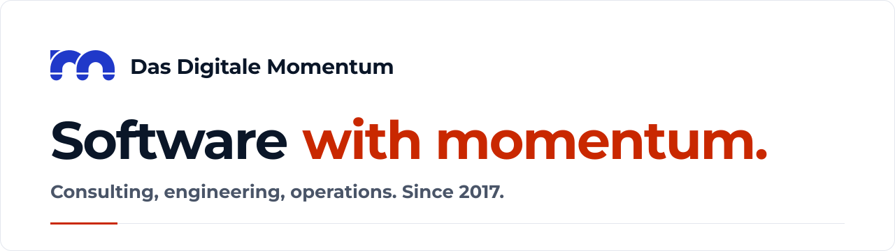
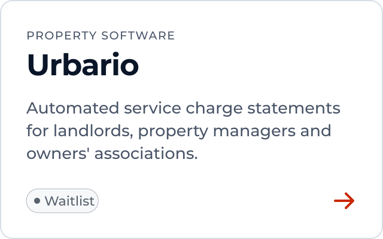
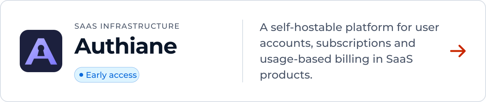
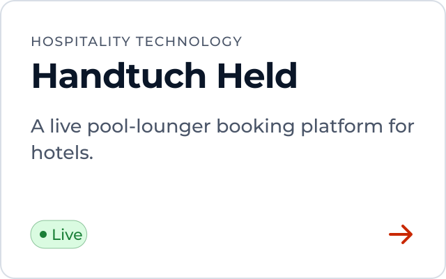
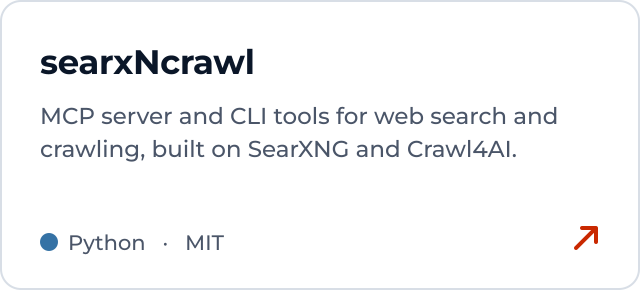
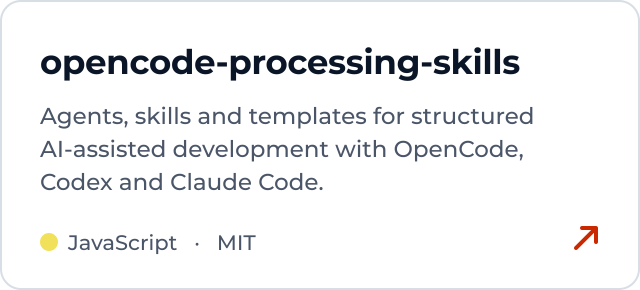
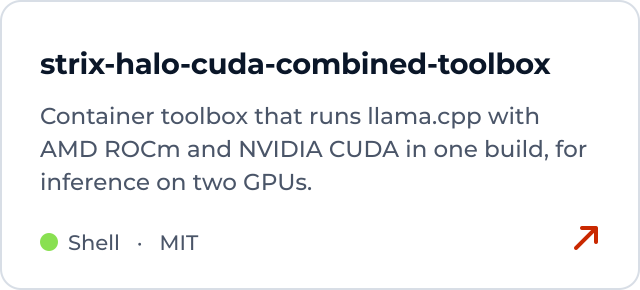
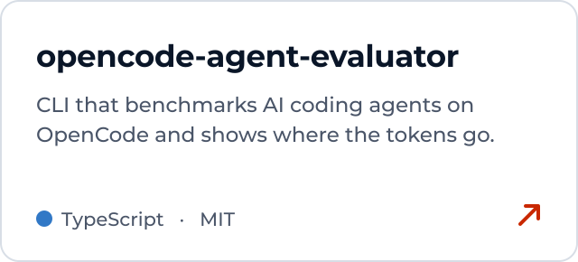
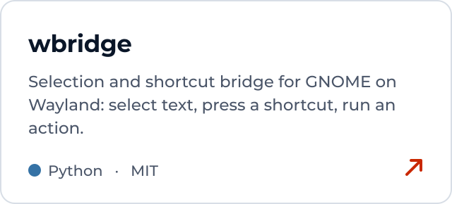
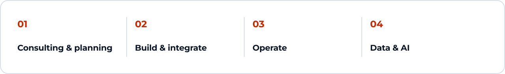

<picture>
  <source media="(prefers-color-scheme: dark)" srcset="assets/header-dark.svg">
  
</picture>

 

Das Digitale Momentum builds software for companies and its own products. The same team consults, builds and runs both: cloud, DevOps, data and AI, from Much, Germany.

<a href="https://www.das-digitale-momentum.de/en/"><b>Website</b></a> &nbsp;·&nbsp;
<a href="https://www.das-digitale-momentum.de/en/open-source/"><b>Open source</b></a> &nbsp;·&nbsp;
<a href="https://www.linkedin.com/company/das-digitale-momentum"><b>LinkedIn</b></a> &nbsp;·&nbsp;
<a href="mailto:info@ddm-it.de"><b>info@ddm-it.de</b></a>

 

### Our products

<a href="https://www.urbario.de/"><picture><source media="(prefers-color-scheme: dark)" srcset="assets/cards/product-urbario-dark.svg"></picture></a>
<a href="https://www.authiane.com/"><picture><source media="(prefers-color-scheme: dark)" srcset="assets/cards/product-authiane-dark.svg"></picture></a>
<a href="https://www.handtuchheld.com/"><picture><source media="(prefers-color-scheme: dark)" srcset="assets/cards/product-handtuch-held-dark.svg"></picture></a>

 

### Open source

Tools from our own work, MIT-licensed.

<a href="https://github.com/DasDigitaleMomentum/searxNcrawl"><picture><source media="(prefers-color-scheme: dark)" srcset="assets/cards/oss-searxncrawl-dark.svg"></picture></a>
<a href="https://github.com/DasDigitaleMomentum/opencode-processing-skills"><picture><source media="(prefers-color-scheme: dark)" srcset="assets/cards/oss-opencode-processing-skills-dark.svg"></picture></a>

<a href="https://github.com/DasDigitaleMomentum/strix-halo-cuda-combined-toolbox"><picture><source media="(prefers-color-scheme: dark)" srcset="assets/cards/oss-strix-halo-cuda-combined-toolbox-dark.svg"></picture></a>
<a href="https://github.com/DasDigitaleMomentum/opencode-agent-evaluator"><picture><source media="(prefers-color-scheme: dark)" srcset="assets/cards/oss-opencode-agent-evaluator-dark.svg"></picture></a>

<a href="https://github.com/DasDigitaleMomentum/wbridge"><picture><source media="(prefers-color-scheme: dark)" srcset="assets/cards/oss-wbridge-dark.svg"></picture></a>

 

### What we do

<a href="https://www.das-digitale-momentum.de/en/expertise/"><picture><source media="(prefers-color-scheme: dark)" srcset="assets/cards/expertise-dark.svg"></picture></a>

 

Das Digitale Momentum GmbH & Co. KG · Loßkittel 3, 53804 Much, Germany · <a href="https://www.das-digitale-momentum.de/impressum/">Legal notice</a> · <a href="https://www.das-digitale-momentum.de/en/privacy/">Privacy</a>
